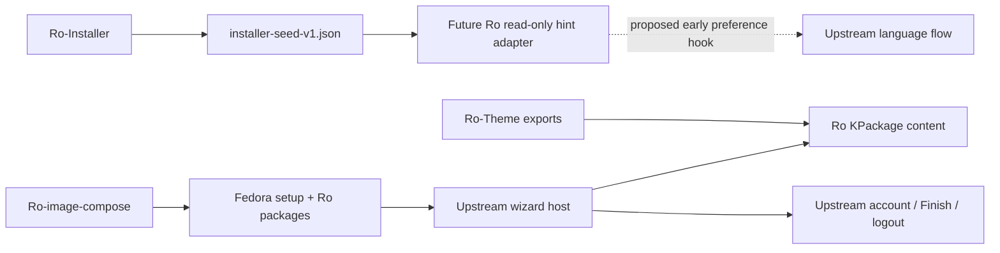

# PR-01: Ro-Plasma-Setup architecture gate

Date: 2026-10-09 (Europe/Istanbul)

Status: proposed decision; source and RPM inspection completed

Target: Fedora 44, KDE Plasma 6.7.x; inspected package: `6.7.5-1.fc44`

## 1. Decision

Recommend **B: a separate Ro-ASD customization package with minimal upstream
integration**. Start with strategy A's documented KPackage pages and ordinary
KDE appearance defaults. Keep Fedora's `plasma-setup` as the application and
lifecycle owner; keep Ro content, translations and seed adaptation separate.

Full branding of the initial landing screen, built-in completion page and
built-in light/dark selector is **not supported by configuration in 6.7.5**.
Neither is deterministic ingestion of the installer seed before the language
page initializes. Address these gaps through small generic upstream hooks
before enabling the dependent features. A separate resource RPM cannot add
missing application hooks. This proposal authorizes no patched Plasma Setup
build, source fork or replacement wizard.

If those hooks do not ship in the selected Fedora baseline, retain the supported
subset: Ro introduction and overview pages inside the upstream wizard, with
upstream landing and final presentation. Label that reduced scope openly.
Do not use unsupported overrides to claim full branding.

The architecture choice can proceed; full product acceptance remains gated on
the missing interfaces and VM evidence. This PR contains documentation only.
See [research findings](RESEARCH-PR-01.md) and the
[pinned baseline](research/baseline-2026-10-09.json).

## 2. Ownership boundaries

| Component | Owns | Boundary |
| --- | --- | --- |
| Ro-Installer | Installation, target cleanup, minimal firstboot handoff | Preserve seed and trigger cleanup; no new branding/account work |
| Upstream/Fedora Plasma Setup | Setup system user, trigger, functional pages, privileged helpers, account creation, completion flag and logout | Ro content does not call account or completion helpers |
| Ro-Theme | Shared tokens, themes, artwork and currently delegated logo | Export assets once; no independent palette/logo copies here |
| Ro-Plasma-Setup | Ro-specific OOBE content, translations, presentation adapters and optional hint reader | No account fields/backend, authentication, login-manager overrides or completion state |
| Ro-image-compose | Package selection, presets/integration, live/installed separation and ISO evidence | Integrate tested packages later; do not make the installer activate branding |
| Ro-Assist | Post-login onboarding and maintenance | Keep package installation, hardware help and account-dependent actions after login |

The existing branding contract delegates the current Ro-Theme logo to Ro-Theme,
while `ro-asd-branding` owns distribution identity policy. Moving that asset
needs a separate owner decision. Ro-Plasma-Setup must not change Fedora
`os-release` or release identity to obtain branded text. Application branding
can display Ro-ASD without changing machine identity.
[Branding contract][branding-contract], [defaults contract][defaults-contract].

No other repository is modified in PR-01. No QML wizard, RPM implementation,
release, RPM publication, account or installer change is included.

## 3. Verified Fedora architecture

### Boot and lifecycle

The installed `plasma-setup.service` runs `/usr/libexec/plasma-setup-bootutil`
before `display-manager.service`, conditional on the absence of
`/etc/plasma-setup-done`, and excludes `rd.live.image`. Bootutil selects Plasma
Login Manager when `plasmalogin.service` reports enabled, otherwise SDDM, and
writes upstream's temporary `99-plasma-setup.conf`. The service prepares the
graphical session; it is not the GUI process.
[Service][service], [bootutil][bootutil].

Upstream sysusers/tmpfiles create the `plasma-setup` system user and ephemeral
home `/run/plasma-setup`. Its autostart entry runs the executable in a Plasma
session. Upstream supplies KAuth and Polkit integration. Custom QML pages are
therefore trusted system software inside an environment with setup privileges.
Use those privileges only through the existing upstream functional pages.
[Sysuser][sysuser], [tmpfiles][tmpfiles], [autostart][autostart].

`InitialStartUtil` removes setup autologin when running as the setup user.
The host Finish button calls upstream `finish()`, which performs user creation
when needed, writes its flag and requests logout. New-user temporary autologin
calls are commented out in this release; the completion page instructs the
user to sign in. Preserve this behavior.
[Wizard][wizard], [finish flow][initial-start].

Fedora's RPM also has a `fedora-release-common < 44` upgrade trigger that marks
the machine configured unless `/etc/reconfigSys` exists. An upgrade differs
from a fresh Ro installation. Compose must verify target marker state and
enabled/preset service; package installation alone does not prove firstboot
will run. [Fedora spec][fedora-spec].

### Host versus extension pages

`Main.qml`, `Wizard.qml`, `LandingComponent.qml` and `SessionMenu.qml` are
compiled into the application's QML module. `main.cpp` loads its `Main` via
`loadFromModule()`. There is no documented alternate-shell argument. Installing
a same-named loose QML file is not a supported shell replacement.
[GUI build][gui-build], [entry point][main].

Functional pages use a different mechanism. `PagesModel` discovers
`KDE/PlasmaSetup` KPackages; the package structure uses `plasma/packages`,
requiring `contents/ui/main.qml`. It sorts integer `X-KDE-Weight`, constructs
modules to inspect `available`, then constructs accepted modules again for
display. Roots must be `org.kde.plasmasetup.components.SetupModule`, not merely
`QQuickItem`. This extension mechanism is explicitly documented.
[Module guide][custom-modules], [loader][pages-model],
[package structure][package-structure].

| Weight | Installed module suffix | Condition / behavior |
| ---: | --- | --- |
| 0 | language | Upstream language selection |
| 5 | keyboard | Hidden on mobile |
| 10 | prepare | Theme toggle; display-scaling UI is commented out |
| 20 | account | Hidden when upstream detects existing regular users |
| 30 | hostname | Available when hostname is considered default |
| 40 | time | Time zone |
| 50 | wifi | Depends on wireless-device presence |
| 200 | finished | Built-in final presentation |

All eight installed QML payloads and weights were checked in the exact RPM.
Cellular exists in source at weight 60, but its installation is commented out;
it is not a Fedora 6.7.5 installed page. The guide's illustrative description
of WiFi skipping is less precise than its actual availability expression.
Use installed source/payloads as the baseline.
[Module installation][modules-build], [WiFi source][wifi-source].

### Configuration

Fedora owns `/etc/xdg/plasmasetuprc` as `%config(noreplace)`. The inspected
implementation consumes `[Accounts] UserGroups`; the controller opens the
build-time absolute path with `KConfig::SimpleConfig`. It is not a branding
cascade or configuration-fragment directory. Leave this account setting
untouched. There are no implemented logo, welcome, ordering, shell,
initial-language or theme-ID keys there.
[Configuration][setup-config], [controller][account-controller].

KDE appearance defaults still affect Qt/Kirigami controls through their own
mechanisms. Do not infer setup-specific customization from the existence of
`plasmasetuprc`.

## 4. Customization matrix

“Public” means deliberately documented in this release, not a stable ABI
promise for all future Plasma versions. “Convention” means a KDE/Fedora
resource mechanism needing target-system verification. “Source” means an
upstream change or downstream patch is necessary for the requested behavior.

| Aspect | Fork-free capability in the inspected build | Limit / classification |
| --- | --- | --- |
| Welcome screen | Add a Ro introduction KPackage after language | Public added page. Initial landing copy/icon/composition are compiled QML; replacing them is Source |
| Logos/artwork | Ro pages can load canonical Ro-Theme assets | Public page content. No global logo slot; landing uses a Plasma symbolic icon, finished uses Konqi. Do not replace upstream assets |
| Global colors | Qt desktop style and Kirigami colors can inherit KDE defaults | Convention. No setup palette/CSS bundle API; landing contains explicit white text and black overlays |
| Typography | Ro content can inherit fonts and use Kirigami headings/font-relative sizes | Convention/public page content. Landing/shell headings set 18 points; no global typography-token hook |
| Navigation/layout | Host supplies Back/Next/Finish; pages control content and `nextEnabled` | Public validation/content. Outer card geometry, transitions, heading/footer and button labels are compiled; replacing them is Source |
| Custom QML pages | Add unique `KDE/PlasmaSetup` packages in `/usr/share/plasma/packages/` | Public; a separate optional C++ utility is documented |
| Page order | Choose new pages' integer `X-KDE-Weight` between built-ins | Public additions. No config list to reorder/disable/replace built-ins; editing their metadata changes packaged files |
| Default theme | Ro-Theme can supply initial KDE defaults and `org.ro.light`/`org.ro.dark` | Convention for initial appearance. Built-in toggle applies Fedora IDs and detects only `BreezeDark`; Ro choices require Source |
| Language handoff | Upstream uses system locale and applies user language selections | Public user flow. No installer-seed reader, initial-hint option or documented early hint hook; deterministic handoff requires integration/Source |
| Completion screen | Add a Ro overview before the upstream finished module | Public addition. Replacing/branding final content needs a supported upstream slot or Source; upstream retains Finish |
| Landing wallpaper | Fedora patch locates its distribution-default wallpaper through standard data paths | Fedora Convention, not an upstream branding API. Exact paths/formats matter; no overwriting Fedora `Default` resources |

Evidence: [landing][landing], [wizard][wizard], [prepare utility][prepare-util],
[language utility][language-util], [finished module][finished] and the exact
SRPM's two Fedora patches; see [research R4–R8](RESEARCH-PR-01.md#r4-fedora-branding-patches).

### Extension contract and hazards

Use documented `available`, `nextEnabled`, `contentItem`. The source also
exposes `cardWidth`, supplied by the host: consume it for content sizing,
not to resize the host card. Use IDs `org.ro.plasmasetup.*` and the documented
`KPackageStructure`, `KPlugin`, `X-KDE-ParentApp` and weight metadata.
[Module guide][custom-modules], [SetupModule][setup-module].

Availability is evaluated during reload, not maintained as a live model
visibility binding. Discovery constructs and discards an instance; display
constructs another. Constructors, QML completion handlers and availability
checks must have no persistent effects. Source-level `onPageActivated()` runs
on forward navigation, not initial display or backward navigation. It is not
a general lifecycle callback. No documented page-save/finalization transaction
or progress-persistence API exists. [Loader][pages-model], [wizard][wizard].

Weights have no tie-breaker. Missing/malformed values can become zero. Require
valid integer metadata and reserved unique Ro weights. Proposed first content:
**1** for introduction (after language, before keyboard), **190** for overview
(before finished). Keep language first and upstream finished last. The host
uses positional finality, so adding a page above 200 would make that page final.

Do not shadow upstream IDs, edit built-in metadata, replace packaged QML,
override `org.kde.*` imports, walk/mutate host internals or substitute upstream
translation catalogs. General KPackage lookup does not make same-ID
replacement a supported Plasma Setup contract.

## 5. Strategy comparison

| Criterion | A. Supported KPackages/config only | B. Separate customization package + minimal upstream integration | C. Plasma Setup fork |
| --- | --- | --- | --- |
| Host/lifecycle | Fedora unchanged | Fedora unchanged once generic hooks ship | Ro carries/reconciles upstream source, including lifecycle |
| Ro information pages | Available today | Available today | Fully controllable |
| Exact landing/final branding | Unavailable today | Small presentation hooks needed | Source changes under Ro control |
| Ro light/dark choices | Initial defaults; selector can switch away | Configurable selection/detection hook | Patch and maintain selector |
| Seed before language | No direct support | Separate Ro reader + deterministic startup hook | Reader coupled to fork |
| Packaging | Additive noarch resources | Additive resources + optional small native adapter | Replacement application build, Fedora spec/patch tracking |
| Maintenance | Low; still test ordering/API | Low to moderate with upstream hooks and version gates | High; continual rebases and downstream bug/security ownership |
| Full objective | Partial | Conditional on shipped hooks | Achievable with ongoing maintenance burden |
| Decision | Initial subset/fallback | **Recommended** | Reject at this stage |

A is suitable for a deliberately reduced experience, even when shipped as a
separate RPM. B gives the full objective a maintainable path while isolating
Ro content and seed adaptation from the host. C creates a second application
maintenance stream for privileged firstboot behavior Ro does not want to own.

Temporary downstream source patches under B would require rebuilding/replacing
Fedora's `plasma-setup`; a branding RPM alone cannot carry them. That is a
separate decision, not implicit authorization here. Prefer upstream hooks,
and retain A's subset while waiting.

## 6. Proposed minimal upstream hooks

These are **proposals**, not existing 6.7.5 keys/APIs/package types:

1. Optional distribution presentation descriptor for landing title/logo/
   wallpaper and assets/text inside the existing final presentation. Keep
   upstream navigation and Finish routing; use Ro's translation domain and
   fall back to upstream presentation on missing/invalid resources.
2. Configurable light/dark look-and-feel IDs and correct initial detection from
   selected theme/palette. Defaults preserve upstream behavior. Ro values are
   `org.ro.light` and `org.ro.dark`; do not disguise assets as Fedora/Breeze IDs.
3. Deterministic non-privileged initial language preference input, before
   language-page initialization. The user can override it; upstream retains
   validation/application. A Ro reader converts JSON to this input, so upstream
   does not need to know Ro's seed schema.

Agree exact interfaces with upstream using existing Qt/KConfig/KPackage
mechanisms; do not invent an alternate plugin framework. A general shell
replacement is unnecessary for the first branded version. Defer outer geometry
and typography changes until upstream offers a supported presentation surface.
Hooks need upstream documentation, tests, resource validation and fallback
before adoption in the selected Fedora build.

Do not invent `[Branding]`, `InitialLanguage`, `ThemePackage`,
`plasmasetuprc.d` or a command-line seed flag and assume Fedora consumes them.

## 7. Ro-Theme token and asset reuse

Inspected commit: `ccfba78000cadaedf82baa78b536964d16110b41`, dated 2026-10-09.
Its spec declares `ro-theme 1.0.1-2`; `VERSION` is `1.0.1`. This is source/spec
inspection, not a claim that this revision is released or installed.
[Snapshot][theme-tree], [spec][theme-spec].

| Existing source/output | OOBE reuse | Packaging today |
| --- | --- | --- |
| `core/tokens/colors.{light,dark}.json` | Semantic colors through generated KDE RoLight/RoDark schemes and `Kirigami.Theme` | Schemes installed in `/usr/share/color-schemes/` |
| `spacing.json`, `radius.json`, `opacity.json`, `motion.json` | Geometry/surface/motion in Ro content | Source tokens are not a public runtime module |
| `dist/qml/RoTokens.qml` | Generated singleton; deliberately omits colors in favor of Kirigami | Not exported by RPM; tree has no public `qmldir` |
| `dist/tokens/ro-colors.json`, `.css`, `ro-tailwind.js` | Generator/reference outputs for other consumers | CSS/Tailwind are not Qt wizard inputs |
| `platform/plasma/look-and-feel/org.ro.{light,dark}` | Canonical global themes | Installed in `/usr/share/plasma/look-and-feel/` |
| `assets/brand/roasd-logo.png` | Canonical Ro logo | Shipped inside Plymouth today; no shared `/usr/share/ro-theme/brand/` export |
| `assets/wallpapers/{light,dark,loginv2}.jpg` | Background candidates after crop/contrast review | `/usr/share/ro-theme/wallpapers/{light,dark,login}.jpg`; not Fedora `Default` layout |

[Token sources][theme-tokens], [generated QML][theme-qml],
[assets][theme-assets], [payload][theme-spec].

Brand navy is `#213966`; semantic accent is `#3059A6` light / `#7DA2E8` dark.
These are evidence values, not constants to duplicate in setup QML. Generated
QML includes `spaceMd=12`, `radiusPanel=18` and fast motion 120 ms. No typography
token exists: inherit KDE fonts and Kirigami font-relative sizing.
[Light][theme-light], [dark][theme-dark], [QML][theme-qml].

Before implementing a runtime consumer, agree a **versioned Ro-Theme export
contract** in a separate future Ro-Theme PR: canonical shared asset path plus
an importable QML module/singleton or explicitly versioned generated data.
URI/path/version do not exist yet. Ro-Theme owns exports, generation and tests;
Ro-Plasma-Setup owns a small consumer adapter. Do not hand-copy `RoTokens.qml`
here, even though its current comment suggests copying it into widgets.

If build-time export is selected instead, pin source/artifact hash and generator
provenance. Generated setup data remains derivative, never a separately edited
palette. Canonical artwork/color schemes remain runtime Ro-Theme dependencies.
Honor high contrast, font scaling and animation settings; apply a duration
factor to Ro content and avoid depending on blur/compositing for readability.
Shared tokens do not automatically restyle the upstream wizard shell.

Current Ro-Theme `kdeglobals` defaults to `ColorScheme=RoDark` and
`LookAndFeelPackage=org.ro.dark`. Current `%post` no longer writes user settings;
the reset tool is opt-in for the current user. The local release defaults
document describes an older all-user script behavior. Base integration on the
inspected revision without modifying that other repository in PR-01.
[Current spec][theme-spec], [reset tool][theme-reset], [policy snapshot][defaults-contract].

## 8. Theme selection and new-user propagation

Test three distinct states: initial setup-session appearance, built-in toggle
state/choices, and resulting new-user appearance. Defaults alone prove none
of their consistency.

Fedora's toggle applies `org.fedoraproject.fedora.desktop` /
`org.fedoraproject.fedoradark.desktop`; initial detection still compares with
`BreezeDark`. A RoDark session can have a dark palette but an unchecked switch;
toggling can apply a Fedora theme. These are source findings, not VM observations.
[Fedora patch][fedora-theme-patch], [prepare utility][prepare-util].

Upstream copies `/run/plasma-setup/.config/kdeglobals` to the newly created
user's `.config/kdeglobals`. This function does not copy the full theme config
set. A missing setup-local file can make the copy fail; copied Fedora selections
can mask Ro cascading defaults. Existing users skip the upstream new-user
steps. [Helper][auth-helper], [finish flow][initial-start].

Do not work around this with Ro RPM scripts/home writes or extra privileged
calls from a completion page. Test and request upstream theme support as
needed; keep account creation and theme propagation in upstream ownership.

## 9. Installer seed and language handoff

Preserve the exact path and shape:

```text
/var/lib/ro-asd/firstboot/installer-seed-v1.json
```

```json
{
  "schema_version": 1,
  "installer_ui_language_hint": "tr"
}
```

Producer/tests allow exactly those two fields. Finalization writes mode `0644`.
Separate install metadata is storage provenance. This is a UI language hint,
not consent to configure locale, keyboard, timezone or account preferences.
[Producer][seed-producer], [tests][seed-tests], [finalization][installer-finalization].

No reader for this path/schema exists in the inspected upstream/Fedora source.
Upstream starts from `QLocale::system()`, discovers language codes from
`plasmashell` translations, and applies selections through its own session
locale handling and `org.freedesktop.locale1.SetLocale`. It also applies a
fallback when the initial language is unavailable. Preserve that functional
flow; it is not a seed bridge. [Language utility][language-util].

The future Ro reader should:

- Run without root in the setup session and read only the public hint.
- Accept a bounded UTF-8 JSON object, schema 1, exactly two allowed keys.
  Reject extra/duplicate keys, unsupported schema, wrong types, empty/oversized
  values and malformed input; continue without a hint.
- Use an explicit reviewed mapping for installer codes including `tr`, `en`,
  `pt_BR`, `zh_CN`, `fa`; validate against upstream's available set and installed
  locale/translation resources. Do not blindly append `.UTF-8` or infer country,
  keyboard or timezone.
- Supply only an initial preference through the future deterministic hook.
  User selection wins. Apply no persistent system setting independently;
  upstream retains its language-application semantics.
- Treat missing/unreadable/unsupported data as optional. Never delete, rewrite,
  migrate or mark the seed consumed; its presence is neither trigger nor
  completion state.

A weight-1 page is too late to reliably initialize the preceding language
page. Probe/constructor effects or asynchronous singleton writes are not a
startup protocol. Until the early input exists and passes tests, leave handoff
inactive and retain upstream selection.



The dashed input is a future gate, not an implemented hook.

## 10. Repository and RPM boundaries

Proposed eventual structure; PR-01 creates only documentation:

```text
Ro-Plasma-Setup/
  README.md
  docs/
    ARCHITECTURE-PR-01.md
    RESEARCH-PR-01.md
    research/baseline-2026-10-09.json
    contracts/                 # future presentation/export/hint contracts
    compatibility/             # certified NEVRAs and migration evidence
  CMakeLists.txt               # later KPackage/translation installation
  modules/
    welcome/                   # later org.ro.plasmasetup.welcome, weight 1
    overview/                  # later org.ro.plasmasetup.overview, weight 190
  src/handoff/                 # optional native reader, after interface agreement
  presentation/               # descriptor for a shipped upstream hook
  po/                         # separate Ro catalogs
  packaging/                  # later spec and ownership manifest
  tests/{contracts,qml,integration}/
```

Do not vendor upstream account/auth/bootutil/shell/session/finished code or
independent logo/palette/wallpaper masters.

| Package | Payload/owner | Dependency and restrictions |
| --- | --- | --- |
| Fedora `plasma-setup` | Executable, core pages, package structure, QML components/utilities, service/sysuser/tmpfiles, KAuth/Polkit | Keep intact; no Ro addon `Provides`/`Obsoletes`/`Conflicts` replacement |
| `ro-asd-plasma-setup` (proposed noarch) | Ro pages, `.mo` catalogs and Ro descriptor/config once a consuming hook ships | Requires tested setup, used QML imports and compatible Ro-Theme exports; payload allowlist |
| `ro-asd-plasma-setup-handoff` (optional arch-specific subpackage) | Native/QML hint reader only if required | Matching addon, public Qt/KF interfaces; no root daemon, Polkit rule or account backend |
| `ro-theme` / possible export subpackage | Canonical token module/data, schemes, global themes and shared assets | Ro-Theme retains generation/ownership; agree the split there later |
| `ro-asd-branding` | Distribution identity policy and future explicitly reassigned brand assets | Respect delegation; never package a second canonical logo copy |

Keep QML-only pages noarch. Native utility code stays outside KPackage content
directories, as upstream documents. Specify QML/runtime dependencies even
where RPM auto-generates provides. `qt6qml(org.kde.plasmasetup.*)` does not
establish a stable SDK for every helper. Avoid `.private` imports, private
C++ headers, AccountController and InitialStartUtil dependencies in Ro pages.

Install additive pages in
`/usr/share/plasma/packages/org.ro.plasmasetup.<name>/`, and Ro catalogs in
`/usr/share/locale/<locale>/LC_MESSAGES/org.ro.plasmasetup.mo`. A future descriptor
uses a unique Ro data path. Administrator-editable Ro config is
`%config(noreplace)` only after a real consuming interface/ownership agreement.

Do not own Fedora `plasmasetuprc`, existing Ro-Theme `/etc/xdg` files, Fedora
`wallpapers/Default`, upstream page/import paths, autostart entries, units,
login-manager overrides, `/run/plasma-setup` or `/etc/plasma-setup-done`.
No `%post` page activation, setup execution, theme application, home writes
or marker removal. Installing page files makes them discoverable; compose
owns integration/activation evidence.

Initially certify exact `6.7.5-1.fc44`. There is no observed setup API version
to depend on. Choose conservative RPM bounds from actual compatibility tests,
not this one source inspection, and track Fedora rebuilds as well as upstream
versions. Hook-dependent content must be disabled on builds without its
consumer. Do not assume all 6.7.x/6.8 releases supported.

## 11. Extension and translation strategy

Use proposed domain `org.ro.plasmasetup`. QML should explicitly use domain-aware
KI18n functions (`i18nd`, `i18ndc`) because the host uses `org.kde.plasmasetup`.
Leave upstream functional catalogs unchanged. Translate metadata display names
(`Name[tr]`, etc.) as well as bodies: the host refreshes metadata names on
`LanguageChange`. [Host localization][main], [heading refresh][pages-model].

English source strings, reviewed Turkish/English coverage first; additional
languages follow Ro's supported language policy. Ship catalogs offline. Keep
placeholder/context/plural semantics, avoid concatenated sentences, and test
live switching, RTL, expansion and absent-catalog fallback.

Ro pages should be short informational content without irreversible actions
or account state. Post-login maintenance stays in Ro-Assist. Each extension
needs a unique ID/weight, ownership, translation/accessibility coverage and
compatibility review. Removal must leave upstream flow usable.

## 12. Risks and remaining gates

| Risk | Evidence / uncertainty | Response |
| --- | --- | --- |
| Contract drift | Documented pages, no published stable setup SDK version in inspected tree | Pin NEVRA/source; diff loader/base/shell and run actual import tests |
| Partial support looks complete | Landing/shell compiled; final presentation upstream-owned | Label subset and gate full branding on shipped hooks |
| Theme selector leaves Ro | Fedora IDs and `BreezeDark` comparison hard-coded | Configurable choices/detection; setup and new-user tests |
| Defaults masked | Upstream copies setup-local `kdeglobals` to new user | Test missing/present file and explicit selections; no Ro home-write workaround |
| Effects happen during discovery | Module constructed for availability and again for display | Pure initialization, explicit idempotent actions |
| Ordering/finality drift | No weight tie-breaker; last page gets Finish | Validate installed set/weights; language first, upstream finished last |
| Wallpaper coupling | Fedora `Default` JXL lookup and build-time PNG substitution | Supported presentation descriptor later; no path takeover |
| Seed semantics | UI hint only; no upstream consumer; locale fallback can apply during initialization | Optional reader + early-hook/override tests; preserve seed |
| False completion on failure | Creation routine can return on failure; outer `finish()` still attempts flag/logout | Reproduce in disposable VM; require upstream resolution before product acceptance |
| Live/upgrade/fresh differences | Live condition, Fedora upgrade trigger; local compose E2E unfinished | Compose fresh-install/second-boot/live/upgrade fixtures |

The lifecycle finding is concrete: `finish()` calls void
`doUserCreationSteps()`, then `createCompletionFlag()` and `logOut()`. Failed
creation returns from the inner routine without stopping the outer flow.
This is a source-level risk, not a reproduced VM failure. Ro must not add
duplicate completion logic to work around it. Failure injection is an
acceptance gate; a reproduced defect belongs upstream.
[Exact finish source][initial-start].

Remaining interface decisions: presentation descriptor, early language input,
Ro-Theme export URI/version and package compatibility policy. They do not
prevent selecting B's ownership architecture; they prevent claiming the full
experience works on the current package.

## 13. Small-PR implementation plan

Other-repository entries are future coordination proposals; no such repository
is modified or messaged by PR-01.

| Step/owner | Small deliverable | Exit evidence / dependency |
| --- | --- | --- |
| **PR-01 / Ro-Plasma-Setup** | Decision, source evidence and baseline | Review B, ownership and unsupported features; no wizard |
| PR-02 / Ro-Plasma-Setup | Reproducible inspection + development-only page-load harness | Exact loader/import/weights tested; no production pages or boot activation |
| Separate Ro-Theme PR | Versioned shared token/brand exports and ownership manifest | Reproducible generator + public path/import tests |
| PR-03 / Ro-Plasma-Setup | One introduction page, weight 1 | Published exports; load/layout/RTL/two-language tests; no writes |
| PR-04 / Ro-Plasma-Setup | One overview page, weight 190 | Finished remains last; Back and conditional pages work |
| PR-05 / Ro-Plasma-Setup | Additive noarch packaging + payload ownership checks | Local build/install/remove/upgrade in disposable Fedora VM; no publication |
| Separate upstream changes | Presentation and configurable theme hooks, reviewed separately | Upstream defaults/docs/tests; shipped in selected Fedora baseline |
| PR-06 / Ro-Plasma-Setup | Descriptor/appearance integration | Missing-hook fallback, toggle and new-user theme evidence |
| Separate upstream input + PR-07 / Ro-Plasma-Setup | Agree early language interface; implement small seed reader | Exact allowlist/mapping/fallback/user override; seed unchanged |
| Separate Ro-image-compose PR | Tested packages in image/profile, activation acceptance | Install/reboot/firstboot/live/second-boot/upgrade evidence; installer unchanged |
| PR-08 / Ro-Plasma-Setup | Maintenance policy and certification | Full VM suite including failure paths; no unresolved false-completion issue |

PR-06/07 wait for interfaces; replacing upstream files is not a scheduling
shortcut. PR-03/04 implement the explicitly partial subset. Releases and RPM
publication are outside this gate and require a later task.

## 14. Test strategy

### Upstream/package compatibility

For each candidate, obtain exact source/binary RPMs, record NEVRA/digests/Fedora
patches, and compare package structure, module base, loader, metadata,
availability, positional finality, localization, language startup, themes and
Finish routing. Check file overlap with Fedora setup, `kde-settings`, Ro-Theme
and Ro packages. Do not certify against KDE `master` alone.

In a disposable Fedora 44 environment, list/load packages through KPackage and
instantiate content using the real provided QML module. Run lint/import and
graphical tests; metadata discovery alone does not prove loadability. Validate
bad/missing/duplicate weights and dependencies before delivery. Test optional
Ro content failure rather than assuming every host invalid-component path
recovers safely. Use public interfaces, not linked internal C++ headers.

### Contracts, translations and visuals

- Seed: valid codes, missing/unreadable input, malformed JSON, duplicate/extra
  keys, wrong schema/types, bounds and unsupported locale. No seed/system
  mutation; user choice wins through the agreed upstream interface.
- Exports: generated data matches canonical revision, compatible export version,
  paths/imports, readable missing-artwork fallback, no addon-owned logo copy.
- Pages: twice-constructed content has no effects, repeated visits work,
  startup availability and `nextEnabled` work without network for information
  content; language first and upstream finished last.
- Visuals: light/dark, high contrast, 1024×768 and smaller constrained windows,
  HiDPI, large fonts, long Turkish/German text, Arabic/Persian RTL, keyboard
  focus, accessible names, offline assets and motion settings. Inspect actual
  host-card screenshots, not only standalone mockups.

### Disposable VM firstboot acceptance

| Scenario | Required evidence |
| --- | --- |
| Live ISO | `rd.live.image` suppresses setup; installer usable; no live OOBE account/marker leaks to target |
| Fresh install/first installed boot | Exact v1 seed; no live user/completed flag; correct service/preset; upstream bootutil/session starts |
| New account + Finish | Existing validation/group policy, one upstream-created user, setup autologin removed, upstream flag created, normal sign-in |
| Second boot | No setup loop/duplicate account; locale and appearance work |
| Abort/reboot before Finish | No Ro marker/account creation; upstream can restart; seed intact; already applied upstream locale/network state recorded accurately |
| Existing regular user | Account page skipped by upstream; no Ro user-config/identity rewrite; existing-user completion flow |
| User creation / flag-write failure | Fault injection establishes actual behavior; no false completion is required for product acceptance; identified baseline path resolved upstream if reproduced |
| Theme untouched/light/dark | Initial palette, toggle and result checked separately; no unexpected Fedora override; test missing setup-local `kdeglobals` |
| Hint valid/changed/invalid | Preference only once hook exists; user override, upstream application and unchanged seed; no fabricated keyboard/country choices |
| Offline/no WiFi | Upstream availability correct; Ro pages/catalogs fully offline |
| RPM upgrade/remove | Existing marker/accounts and admin `%config(noreplace)` edits preserved; upstream usable without addon |
| Earlier Fedora upgrade | Exercise package trigger separately; established machine does not unexpectedly enter OOBE |

Collect journals, service/preset state, package manifest/module order,
flag/autologin state, seed digest, relevant setup/new-user theme configs and
screenshots. Exclude passwords/credential-bearing account data. Use snapshots
and isolated disks; never launch the privileged setup app on the development
desktop for a smoke test.

Certification applies to a specific Fedora package set. At updates, source
diff + affected contract tests precede a full firstboot suite. Any change in
Finish, autologin, helper policy or theme propagation requires lifecycle review
even when Ro addon source is unchanged.

### PR-01 verification boundary

Inspected exact Fedora source/binary RPMs, applied two source patches in `/tmp`
for analysis, matched all eight installed page QML files and weights, checked
config/service/scriptlets and confirmed patched wallpaper/theme identifiers in
binary resources. Selected Ro-Theme text snapshots match pinned Git blob IDs.
Read local seed/policy files and tests without edits.

No wizard implemented/launched, VM lifecycle test, ISO build, RPM installation
or publication occurred. Runtime acceptance remains future work.

[branding-contract]: https://github.com/Project-Ro-ASD/Ro-ASD-release/blob/2f751e387c5d199be2f58b97a65d6e4f54e4bff4/docs/BRANDING-CONTRACT-V1.md
[defaults-contract]: https://github.com/Project-Ro-ASD/Ro-ASD-release/blob/2f751e387c5d199be2f58b97a65d6e4f54e4bff4/docs/DEFAULTS-OWNERSHIP-V1.md
[service]: https://github.com/KDE/plasma-setup/blob/6089b09b2c4f9b95f58da5c7f2a2d65faf9ba7bd/files/plasma-setup.service.in
[bootutil]: https://github.com/KDE/plasma-setup/blob/6089b09b2c4f9b95f58da5c7f2a2d65faf9ba7bd/src/bootutil/bootutil.cpp
[sysuser]: https://github.com/KDE/plasma-setup/blob/6089b09b2c4f9b95f58da5c7f2a2d65faf9ba7bd/files/plasma-setup-sysuser.conf
[tmpfiles]: https://github.com/KDE/plasma-setup/blob/6089b09b2c4f9b95f58da5c7f2a2d65faf9ba7bd/files/plasma-setup-tmpfiles.conf.in
[autostart]: https://github.com/KDE/plasma-setup/blob/6089b09b2c4f9b95f58da5c7f2a2d65faf9ba7bd/files/plasma-setup.desktop.in
[wizard]: https://github.com/KDE/plasma-setup/blob/6089b09b2c4f9b95f58da5c7f2a2d65faf9ba7bd/src/qml/Wizard.qml
[initial-start]: https://github.com/KDE/plasma-setup/blob/6089b09b2c4f9b95f58da5c7f2a2d65faf9ba7bd/src/initialstartutil.cpp
[fedora-spec]: https://src.fedoraproject.org/rpms/plasma-setup/blob/f44/f/plasma-setup.spec
[gui-build]: https://github.com/KDE/plasma-setup/blob/6089b09b2c4f9b95f58da5c7f2a2d65faf9ba7bd/src/CMakeLists.txt
[main]: https://github.com/KDE/plasma-setup/blob/6089b09b2c4f9b95f58da5c7f2a2d65faf9ba7bd/src/main.cpp
[custom-modules]: https://github.com/KDE/plasma-setup/blob/6089b09b2c4f9b95f58da5c7f2a2d65faf9ba7bd/docs/CUSTOM_MODULES.md
[pages-model]: https://github.com/KDE/plasma-setup/blob/6089b09b2c4f9b95f58da5c7f2a2d65faf9ba7bd/src/pagesmodel.cpp
[package-structure]: https://github.com/KDE/plasma-setup/blob/6089b09b2c4f9b95f58da5c7f2a2d65faf9ba7bd/src/packagestructure/plasmasetuppackage.cpp
[modules-build]: https://github.com/KDE/plasma-setup/blob/6089b09b2c4f9b95f58da5c7f2a2d65faf9ba7bd/modules/CMakeLists.txt
[wifi-source]: https://github.com/KDE/plasma-setup/blob/6089b09b2c4f9b95f58da5c7f2a2d65faf9ba7bd/modules/wifi/contents/ui/main.qml
[setup-config]: https://github.com/KDE/plasma-setup/blob/6089b09b2c4f9b95f58da5c7f2a2d65faf9ba7bd/files/plasmasetuprc
[account-controller]: https://github.com/KDE/plasma-setup/blob/6089b09b2c4f9b95f58da5c7f2a2d65faf9ba7bd/src/accountcontroller.cpp
[landing]: https://github.com/KDE/plasma-setup/blob/6089b09b2c4f9b95f58da5c7f2a2d65faf9ba7bd/src/qml/LandingComponent.qml
[prepare-util]: https://github.com/KDE/plasma-setup/blob/6089b09b2c4f9b95f58da5c7f2a2d65faf9ba7bd/modules/prepareutil/prepareutil.cpp
[language-util]: https://github.com/KDE/plasma-setup/blob/6089b09b2c4f9b95f58da5c7f2a2d65faf9ba7bd/modules/languageutil/languageutil.cpp
[finished]: https://github.com/KDE/plasma-setup/blob/6089b09b2c4f9b95f58da5c7f2a2d65faf9ba7bd/modules/finished/contents/ui/main.qml
[setup-module]: https://github.com/KDE/plasma-setup/blob/6089b09b2c4f9b95f58da5c7f2a2d65faf9ba7bd/src/components/setupmodule.h
[theme-tree]: https://github.com/Project-Ro-ASD/Ro-Theme/tree/ccfba78000cadaedf82baa78b536964d16110b41
[theme-spec]: https://github.com/Project-Ro-ASD/Ro-Theme/blob/ccfba78000cadaedf82baa78b536964d16110b41/packaging/ro-theme.spec
[theme-qml]: https://github.com/Project-Ro-ASD/Ro-Theme/blob/ccfba78000cadaedf82baa78b536964d16110b41/dist/qml/RoTokens.qml
[theme-tokens]: https://github.com/Project-Ro-ASD/Ro-Theme/tree/ccfba78000cadaedf82baa78b536964d16110b41/core/tokens
[theme-assets]: https://github.com/Project-Ro-ASD/Ro-Theme/tree/ccfba78000cadaedf82baa78b536964d16110b41/assets
[theme-light]: https://github.com/Project-Ro-ASD/Ro-Theme/blob/ccfba78000cadaedf82baa78b536964d16110b41/core/tokens/colors.light.json
[theme-dark]: https://github.com/Project-Ro-ASD/Ro-Theme/blob/ccfba78000cadaedf82baa78b536964d16110b41/core/tokens/colors.dark.json
[theme-reset]: https://github.com/Project-Ro-ASD/Ro-Theme/blob/ccfba78000cadaedf82baa78b536964d16110b41/scripts/apply-dark-defaults.sh
[fedora-theme-patch]: https://src.fedoraproject.org/rpms/plasma-setup/blob/f44/f/plasma-setup-select-fedora-lookandfeel.patch
[auth-helper]: https://github.com/KDE/plasma-setup/blob/6089b09b2c4f9b95f58da5c7f2a2d65faf9ba7bd/src/auth/authhelper.cpp
[seed-producer]: https://github.com/Project-Ro-ASD/ro-Installer/blob/59aee77217b5b84eaf5a3dac91d674a371548405/lib/models/installer_handoff.dart
[seed-tests]: https://github.com/Project-Ro-ASD/ro-Installer/blob/59aee77217b5b84eaf5a3dac91d674a371548405/test/models/installer_handoff_test.dart
[installer-finalization]: https://github.com/Project-Ro-ASD/ro-Installer/blob/59aee77217b5b84eaf5a3dac91d674a371548405/lib/services/install_stages/target_finalization_stage.dart
